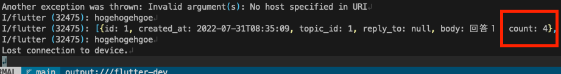

		
SQL Editorでカスタムなqueryの登録試みていたのですが、エラーが発生し結構詰まってしまったので記事にしてみました

##結論

create or replaceで登録ではなく、posgreのviewを利用することで対応することで解決しました

こちらがそれぞれのコード

```sql
 
-- 動かない
create or replace function get_answers() 
returns table (
  id int,
  body text,
  topic_id int,
  reply_to int,
  created_at timestamp,
  count int
)
language sql
as $$
  select *, (select count(*) from answers a2 where a1.id = a2.reply_to) from answers a1;
$$;

-- 動く！
CREATE VIEW public.hogehuga AS
    select *, (select count(*) from answers a2 where a1.id = a2.reply_to) from answers a1;

```

##試したこと

まずは動かないコードですが、公式docや技術ブログ系では機能するといった情報がありましたが、私が実行したところ、id単体(別カラムでもOK)では問題なく機能するのですが、

※動くコード

```sql
 
create or replace function get_answers() 
returns table (
  id int
)
language sql
as $$
  select id from answers;
$$;
```

２つ以上のカラムをreturnしようとしたら下記のエラーが発生しました<br>※最初に提示したコードを実行

```sql
 Failed to run sql query: cannot change return type of existing function
```

エラーを見る限り、既存のfunctionのreturn値を変更できない、とのことですが、そもそもidやtopic_idなど単体では実行が可能だったので、複数選択することで問題が発生するものと思われます

※データ型が正確ではない、という可能性もあります→つまり上記の私のコードが間違い

##PostgreSQLのView機能について

数時間粘っても問題解決できなかったので、下記の参考記事で紹介されている、posgreのviewという機能を利用することにしました

[A view is a convenient shortcut to a query. Creating a view does not involve new tables or data. When run, an underlying query is executed, returning its results to the user.https://supabase.com/blog/2020/11/18/postgresql-views](https://www.postgresql.org/docs/12/sql-createview.html)

簡単に説明すると、特定のqueryを作成して、それに命名した上で実行できるショートカットを作成する、ということです

なので、上記の実行したいコマンドを下記のように設定して実行することで、求める結果を獲得することが可能となります

```sql
 CREATE VIEW public.hogehuga AS
    select *, (select count(*) from answers a2 where a1.id = a2.reply_to) from answers a1;
```

こちらが呼び出し元のコード

```dart
 final answersRequest = client.from('hogehuga').select('*').execute();
```



取得できました！

##参考記事

[Supabaseのデータベースを使うときに役立つ情報](https://qiita.com/kabochapo/items/26b1bb753116a6904664)

[Postgres Views](https://supabase.com/blog/2020/11/18/postgresql-views)

	